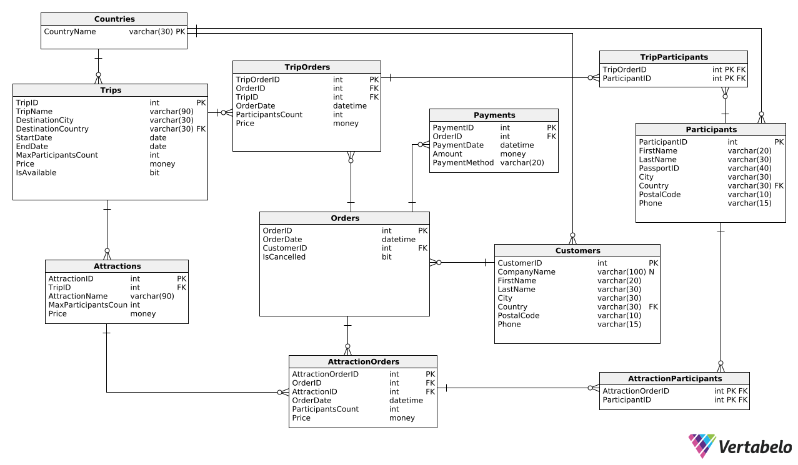

# Bazy danych

**Autorzy:**
Jakub Skwarczek,
Tymoteusz Szwech,
Jakub Warchoł

## 1. Wymagania i funkcje systemu

System wspomaga działalność firmy świadczącej usługi turystyczne. Oferuje on rezerwację różnorodnych wycieczek z określoną datą, limitem miejsc i ceną. Klienci mogą dodatkowo rezerwować usługi i atrakcje związane z daną wycieczką, które również mają swoje limity miejsc i ceny.

Klientami są zarówno osoby prywatne, jak i firmy, które dokonują rezerwacji i płatności za uczestników wycieczki. Przy rezerwacji klient podaje liczbę miejsc oraz wybiera dodatkowe usługi, a najpóźniej na tydzień przed wyjazdem musi podać imiona i nazwiska uczestników. Brak tych danych lub pełnej wpłaty skutkuje anulowaniem zamówienia.

Rezerwacje dodatkowych usług są możliwe tylko wraz z rezerwacją wycieczki. Zmiany w rezerwacji można wprowadzać do tygodnia przed wyjazdem. Po tym terminie zamówienie musi być w pełni opłacone i nie można wprowadzać żadnych zmian. System zapewnia przejrzystość i wygodę obsługi, wspierając efektywne zarządzanie wycieczkami i usługami dodatkowymi.

Lista funkcji jakie użytkownik może wykonywać w systemie.

1. Uzyskanie informacji na temat dostępnej oferty wraz z ilością miejsc oraz ceną.
2. Dodanie rezerwacji wraz z wymaganymi danymi.
3. Zmiana informacji na temat rezerwacji.
4. Anulowanie rezerwacji.
5. Rezerwacja usług/atrakcji w ramach jednej wycieczki.
6. Dodanie informacji na temat płatności.
7. Rejestracja i modyfikacja danych uczestników wycieczki.

## 2. Baza danych

### Schemat bazy danych



### Opis poszczególnych tabel

Nazwa tabeli: **Countries**

- Opis: Tabela słownikowa zawierająca nazwy państw.

| Nazwa atrybutu | Typ         | Opis/Uwagi                 |
| -------------- | ----------- | -------------------------- |
| CountryName    | varchar(30) | Nazwa państwa (**PK, FK**) |

- kod DDL

```sql
CREATE TABLE Countries (
    CountryName varchar(30)  NOT NULL,
    CONSTRAINT Countries_pk PRIMARY KEY  (CountryName)
);
```

Nazwa tabeli: **Trips**

- Opis: Tabela zawierająca informacje dotyczące dostępnych do zamówienia wycieczek.

| Nazwa atrybutu       | Typ         | Opis/Uwagi                                                                        |
| -------------------- | ----------- | --------------------------------------------------------------------------------- |
| TripID               | int         | Identyfikator wycieczki (**PK**)                                                  |
| TripName             | varchar(90) | Nazwa wycieczki                                                                   |
| DestinationCity      | varchar(30) | Miasto, do którego jest wycieczka                                                 |
| DestinationCountry   | varchar(30) | Kraj, do którego jest wycieczka (**FK**)                                          |
| StartDate            | date        | Początek wycieczki; **StartDate < EndDate** - data początku jest przed datą końca |
| EndDate              | date        | Koniec wycieczki                                                                  |
| MaxParticipantsCount | int         | Maksymalna liczba osób, które mogą uczestniczyć; **MaxParticipantsCount > 0**     |
| Price                | money       | Koszt wycieczki; **Price >= 0**                                                   |
| IsAvailable          | bit         | Czy wycieczka jest dostępna do zamówienia (0 - nie, 1 - tak); **DEFAULT - 0**     |

- kod DDL

```sql
CREATE TABLE Trips (
    TripID int  IDENTITY NOT NULL,
    TripName varchar(90)  NOT NULL,
    DestinationCity varchar(30)  NOT NULL,
    DestinationCountry varchar(30)  NOT NULL,
    StartDate date  NOT NULL,
    EndDate date  NOT NULL,
    MaxParticipantsCount int  NOT NULL,
    Price money  NOT NULL,
    IsAvailable bit  NOT NULL DEFAULT 0,
    CONSTRAINT Trips_DateCheck CHECK (StartDate < EndDate),
    CONSTRAINT Trips_PriceCheck CHECK (Price >= 0),
    CONSTRAINT Trips_MPCheck CHECK (MaxParticipantsCount > 0),
    CONSTRAINT Trips_pk PRIMARY KEY  (TripID)
);

ALTER TABLE Trips ADD CONSTRAINT Trips_Countries
    FOREIGN KEY (DestinationCountry)
    REFERENCES Countries (CountryName);
```

Nazwa tabeli: **Attractions**

- Opis: Tabela zawierająca listę dostępnych atrakcji dla wycieczek.

| Nazwa atrybutu       | Typ         | Opis/Uwagi                                                 |
| -------------------- | ----------- | ---------------------------------------------------------- |
| AttractionID         | int         | Identyfikator atrakcji (**PK**)                            |
| TripID               | int         | Identyfikator wycieczki (**FK**)                           |
| AttractionName       | varchar(90) | Nazwa atrakcji                                             |
| MaxParticipantsCount | smallint    | Maksymalna ilość uczestników; **MaxParticipantsCount > 0** |
| Price                | money       | Koszt atrakcji; **Price >= 0**                             |

- kod DDL

```sql
CREATE TABLE Attractions (
    AttractionID int  IDENTITY NOT NULL,
    TripID int  NOT NULL,
    AttractionName varchar(90)  NOT NULL,
    MaxParticipantsCount int  NOT NULL,
    Price money  NOT NULL,
    CONSTRAINT Attractions_PriceCheck CHECK (Price >= 0),
    CONSTRAINT Attractions_MPCheck CHECK (MaxParticipantsCount > 0),
    CONSTRAINT Attractions_pk PRIMARY KEY  (AttractionID)
);

ALTER TABLE Attractions ADD CONSTRAINT Attractions_Trips
    FOREIGN KEY (TripID)
    REFERENCES Trips (TripID);
```

Nazwa tabeli: **Orders**

- Opis: Tabela zawierająca najważniejsze informacje dotyczące głównego zamówienia tj. datę oraz identyfikator klienta.

| Nazwa atrybutu | Typ      | Opis/Uwagi                                                           |
| -------------- | -------- | -------------------------------------------------------------------- |
| OrderID        | int      | Identyfikator zamówienia (**PK**)                                    |
| OrderDate      | int      | Data złożenia zamówienia                                             |
| CustomerID     | datetime | Identyfikator klienta, który złożył zamówienie (**FK**)              |
| IsCancelled    | bit      | Czy zamówienie zostało anulowane (0 - nie, 1 - tak); **DEFAULT - 0** |

- kod DDL

```sql
CREATE TABLE Orders (
    OrderID int  IDENTITY NOT NULL,
    OrderDate datetime  NOT NULL,
    CustomerID int  NOT NULL,
    IsCancelled bit  NOT NULL DEFAULT 0,
    CONSTRAINT Orders_pk PRIMARY KEY  (OrderID)
);

ALTER TABLE Orders ADD CONSTRAINT Orders_Customers
    FOREIGN KEY (CustomerID)
    REFERENCES Customers (CustomerID);
```

Nazwa tabeli: **Payments**

- Opis: Tabela zawierająca informacje dotyczące opłat: daty ich wykonania, kwoty, oraz tego jakiego zamówienia dotyczą.

| Nazwa atrybutu | Typ         | Opis/Uwagi                                                      |
| -------------- | ----------- | --------------------------------------------------------------- |
| PaymentID      | int         | Identyfikator płatności (**PK**)                                |
| OrderID        | int         | Identyfikator zamówienia, które jest opłacane (**FK**)          |
| PaymentDate    | datetime    | Data dokonania płatności                                        |
| Amount         | money       | Kwota płatności; **Amount >= 0**                                |
| PaymentMethod  | varchar(20) | Metoda płatnośc; **PaymentMethod IN ('Cash', 'Card', 'Check')** |

- kod DDL

```sql
CREATE TABLE Payments (
    PaymentID int  IDENTITY NOT NULL,
    OrderID int  NOT NULL,
    PaymentDate datetime  NOT NULL,
    Amount money  NOT NULL,
    PaymentMethod varchar(20) NOT NULL,
    CONSTRAINT Payments_AmountCheck CHECK (Amount >= 0),
    CONSTRAINT Payments_PaymentMethod CHECK (PaymentMethod IN ('Cash', 'Card', 'Check')),
    CONSTRAINT Payments_pk PRIMARY KEY  (PaymentID)
);

ALTER TABLE Payments ADD CONSTRAINT Payments_Orders
    FOREIGN KEY (OrderID)
    REFERENCES Orders (OrderID);
```

Nazwa tabeli: **TripOrders**

- Opis: Tabela z zamówieniami wycieczek, zawierająca informacje między innymi na temat daty złożenia zamówienia.

| Nazwa atrybutu    | Typ      | Opis/Uwagi                                                         |
| ----------------- | -------- | ------------------------------------------------------------------ |
| TripOrderID       | int      | Identyfikator zamówienia wycieczki (**PK**)                        |
| OrderID           | int      | Identyfikator zamówienia (**FK**)                                  |
| TripID            | int      | Identyfikator wycieczki, która została zamówiona (**FK**)          |
| OrderDate         | datetime | Data, kiedy zostało złożone zamówienie                             |
| ParticipantsCount | int      | Liczba uczestników zamówionej wycieczki; **ParticipantsCount > 0** |
| Price             | money    | Cena zamówienia; **Price >= 0**                                    |

- kod DDL

```sql
CREATE TABLE TripOrders (
    TripOrderID int  IDENTITY NOT NULL,
    OrderID int  NOT NULL,
    TripID int  NOT NULL,
    OrderDate datetime  NOT NULL,
    ParticipantsCount int  NOT NULL,
    Price money  NOT NULL,
    CONSTRAINT TripOrders_PriceCheck CHECK (Price >= 0),
    CONSTRAINT TripOrders_ParticipantCountCheck CHECK (ParticipantsCount > 0),
    CONSTRAINT OrderID PRIMARY KEY  (TripOrderID)
);

ALTER TABLE TripOrders ADD CONSTRAINT TripOrders_Orders
    FOREIGN KEY (OrderID)
    REFERENCES Orders (OrderID);

ALTER TABLE TripOrders ADD CONSTRAINT TripOrders_Trips
    FOREIGN KEY (TripID)
    REFERENCES Trips (TripID);
```

Nazwa tabeli: **TripParticipants**

- Opis: Tabela zawierająca identyfikatory uczestników powiązane z konkretnymi zamówieniami wycieczek. Powiązani uczestnicy są na nie zapisani.

| Nazwa atrybutu | Typ | Opis/Uwagi                                      |
| -------------- | --- | ----------------------------------------------- |
| TripOrderID    | int | Identyfikator zamówienia wycieczki (**PK, FK**) |
| ParticipantID  | int | Identyfikator uczestnika (**PK, FK**)           |

- kod DDL

```sql
CREATE TABLE TripParticipants (
    TripOrderID int  NOT NULL,
    ParticipantID int  NOT NULL,
    CONSTRAINT TripParticipants_pk PRIMARY KEY  (TripOrderID,ParticipantID)
);

ALTER TABLE TripParticipants ADD CONSTRAINT TripParticipants_Participants
    FOREIGN KEY (ParticipantID)
    REFERENCES Participants (ParticipantID);

ALTER TABLE TripParticipants ADD CONSTRAINT TripParticipants_TripOrders
    FOREIGN KEY (TripOrderID)
    REFERENCES TripOrders (TripOrderID);
```

Nazwa tabeli: **AttractionOrders**

- Opis: Dodatkowe zamówienia atrakcji podpięte pod zamówienie.

| Nazwa atrybutu    | Typ      | Opis/Uwagi                                    |
| ----------------- | -------- | --------------------------------------------- |
| AttractionOrderID | int      | Identyfikator zamówienia atrakcji (**PK**)    |
| OrderID           | int      | Identyfikator zamówienia wycieczki (**FK**)   |
| AttractionID      | int      | Identyfikator atrakcji (**FK**)               |
| OrderDate         | datetime | Data, kiedy zostało złożone zamówienie        |
| ParticipantsCount | int      | Liczba uczestników; **ParticipantsCount > 0** |
| Price             | money    | Koszt zamówienia; **Price >= 0**              |

- kod DDL

```sql
CREATE TABLE AttractionOrders (
    AttractionOrderID int  IDENTITY NOT NULL,
    OrderID int  NOT NULL,
    AttractionID int  NOT NULL,
    OrderDate datetime  NOT NULL,
    ParticipantsCount int  NOT NULL,
    Price money  NOT NULL,
    CONSTRAINT AttractionOrders_PriceCheck CHECK (Price >= 0),
    CONSTRAINT AttractionOrders_PCCheck CHECK (ParticipantsCount > 0),
    CONSTRAINT AttractionOrders_pk PRIMARY KEY  (AttractionOrderID)
);

ALTER TABLE AttractionOrders ADD CONSTRAINT AttractionOrders_Attractions
    FOREIGN KEY (AttractionID)
    REFERENCES Attractions (AttractionID);

ALTER TABLE AttractionOrders ADD CONSTRAINT AttractionOrders_Orders
    FOREIGN KEY (OrderID)
    REFERENCES Orders (OrderID);
```

Nazwa tabeli: **AttractionParticipants**

- Opis: Tabela zawierająca identyfikatory uczestników powiązane z konkretnymi zamówieniami atrakcji. Powiązani uczestnicy są na nie zapisani.

| Nazwa atrybutu    | Typ | Opis/Uwagi                                     |
| ----------------- | --- | ---------------------------------------------- |
| AttractionOrderID | int | Identyfikator zamówienia atrakcji (**PK, FK**) |
| ParticipantID     | int | Identyfikator uczestnika (**PK, FK**)          |

- kod DDL

```sql
CREATE TABLE AttractionParticipants (
    AttractionOrderID int  NOT NULL,
    ParticipantID int  NOT NULL,
    CONSTRAINT AttractionParticipants_pk PRIMARY KEY  (AttractionOrderID,ParticipantID)
);

ALTER TABLE AttractionParticipants ADD CONSTRAINT AttractionParticipants_AttractionOrders
    FOREIGN KEY (AttractionOrderID)
    REFERENCES AttractionOrders (AttractionOrderID);

ALTER TABLE AttractionParticipants ADD CONSTRAINT AttractionParticipants_Participants
    FOREIGN KEY (ParticipantID)
    REFERENCES Participants (ParticipantID);
```

Nazwa tabeli: **Participants**

- Opis: Tabela zawierająca informacje na temat uczestników.

| Nazwa atrybutu | Typ         | Opis/Uwagi                              |
| -------------- | ----------- | --------------------------------------- |
| ParticipantID  | int         | Identyfikator uczestnika (**PK**)       |
| FirstName      | varchar(20) | Imię uczestnika                         |
| LastName       | varchar(30) | Nazwisko uczestnika                     |
| PassportID     | varchar(40) | Identyfikator paszportu uczesnika       |
| City           | varchar(30) | Miasto zamieszkania uczestnika (**FK**) |
| Country        | varchar(30) | Kraj, z którego pochodzi uczestnik      |
| PostalCode     | varchar(10) | Kod pocztowy                            |
| Phone          | varchar(15) | Telefon kontaktowy do uczestnika        |

- kod DDL

```sql
CREATE TABLE Participants (
    ParticipantID int  IDENTITY NOT NULL,
    FirstName varchar(20)  NOT NULL,
    LastName varchar(30)  NOT NULL,
    PassportID varchar(40)  NOT NULL,
    City varchar(30)  NOT NULL,
    Country varchar(30)  NOT NULL,
    PostalCode varchar(10)  NOT NULL,
    Phone varchar(15)  NOT NULL,
    CONSTRAINT Participants_pk PRIMARY KEY  (ParticipantID)
);

ALTER TABLE Participants ADD CONSTRAINT Participants_Countries
    FOREIGN KEY (Country)
    REFERENCES Countries (CountryName);
```

Nazwa tabeli: **Customers**

- Opis: Tabela z listą klientów oraz ich danymi.

| Nazwa atrybutu | Typ          | Opis/Uwagi                                 |
| -------------- | ------------ | ------------------------------------------ |
| CustomerID     | int          | Identyfikator klienta (**PK**)             |
| CompanyName    | varchar(100) | Nazwa firmy klienta                        |
| FirstName      | varchar(20)  | Imię klienta / reprezentanta firmy         |
| LastName       | varchar(30)  | Nazwisko klienta / reprezentanta firmy     |
| City           | varchar(30)  | Miasto, w którym znajduje się firma        |
| Country        | varchar(30)  | Kraj, w którym znajduje się firma (**FK**) |
| PostalCode     | varchar(10)  | Kod pocztowy                               |
| Phone          | varchar(15)  | Telefon kontaktowy do klienta              |

- kod DDL

```sql
CREATE TABLE Customers (
    CustomerID int  IDENTITY NOT NULL,
    CompanyName varchar(100)  NULL,
    FirstName varchar(20)  NOT NULL,
    LastName varchar(30)  NOT NULL,
    City varchar(30)  NOT NULL,
    Country varchar(30)  NOT NULL,
    PostalCode varchar(10)  NOT NULL,
    Phone varchar(15)  NOT NULL,
    CONSTRAINT Customers_pk PRIMARY KEY  (CustomerID)
);

ALTER TABLE Customers ADD CONSTRAINT Customers_Countries
    FOREIGN KEY (Country)
    REFERENCES Countries (CountryName);
```

## 3. Widoki, procedury/funkcje, triggery

### Widoki

Nazwa widoku: **TripParticipantsCount**

- Opis: Widok ten wyświetla sumę uczestników, która jest zapisana na konkretną wycieczkę. Oprócz tego podaje maksymalną liczbę uczestników na tę wycieczkę oraz ilość wolnych miejsc.

```sql
CREATE VIEW TripParticipantsCount
AS
SELECT Trips.TripID, TripName, StartDate AS TripDate, ISNULL(SUM(ParticipantsCount), 0) AS SumParticipants,
       MaxParticipantsCount, MaxParticipantsCount - ISNULL(SUM(ParticipantsCount), 0) as SlotsLeft
FROM TripOrders
RIGHT JOIN Trips ON Trips.TripID = TripOrders.TripID
WHERE IsAvailable = 1
GROUP BY Trips.TripID, TripName, StartDate, MaxParticipantsCount;
```

| TripID | TripName                    | TripDate   | SumParticipants | MaxParticipantsCount | SlotsLeft |
| :----- | :-------------------------- | :--------- | :-------------- | :------------------- | :-------- |
| 1      | Vienna City Tour            | 2024-06-15 | 7               | 30                   | 23        |
| 2      | Prague Historic Walk        | 2024-07-10 | 2               | 25                   | 23        |
| 3      | Paris Museum Excursion      | 2024-08-05 | 1               | 20                   | 19        |
| 4      | Berlin Wall Experience      | 2024-09-01 | 1               | 35                   | 34        |
| 5      | Athens Ancient Sites        | 2024-10-01 | 40              | 40                   | 0         |
| 6      | Dublin Literary Tour        | 2025-05-14 | 1               | 15                   | 14        |
| 7      | Rome Culinary Adventure     | 2024-11-15 | 1               | 10                   | 9         |
| 8      | Tokyo Technology Tour       | 2024-12-01 | 0               | 50                   | 50        |
| 9      | Krakow Cultural Exploration | 2024-04-10 | 0               | 30                   | 30        |
| 10     | Barcelona Art Journey       | 2025-03-14 | 14              | 25                   | 11        |
| 11     | Bangkok Temple Tour         | 2025-02-05 | 0               | 45                   | 45        |
| 12     | London Royal Sights         | 2025-01-01 | 1               | 20                   | 19        |

Nazwa widoku: **AttractionParticipantsCount**

- Opis: Widok ten wyświetla sumę uczestników, która jest zapisana na konkretną atrakcję. Oprócz tego podaje maksymalną liczbę uczestników atrakcji, numer wycieczki, do której ta atrakcja jest przypisana, jak i liczbę pozostałych miejsc.

```sql
CREATE VIEW AttractionParticipantsCount
AS
SELECT Trips.TripID, TripName, Attractions.AttractionID, AttractionName, Trips.StartDate AS TripDate,
       ISNULL(SUM(ParticipantsCount), 0) AS SumParticipants, Attractions.MaxParticipantsCount,
       Attractions.MaxParticipantsCount - ISNULL(SUM(ParticipantsCount), 0) as SlotsLeft
FROM AttractionOrders
RIGHT JOIN Attractions ON Attractions.AttractionID = AttractionOrders.AttractionID
JOIN Trips ON Trips.TripID = Attractions.TripID
WHERE IsAvailable = 1
GROUP BY Trips.TripID, TripName, Attractions.AttractionID, AttractionName, Trips.StartDate, Attractions.MaxParticipantsCount;
```

| TripID | TripName                    | AttractionID | AttractionName                 | TripDate   | SumParticipants | MaxParticipantsCount | SlotsLeft |
| :----- | :-------------------------- | :----------- | :----------------------------- | :--------- | :-------------- | :------------------- | :-------- |
| 1      | Vienna City Tour            | 1            | Schönbrunn Palace Tour         | 2024-06-15 | 0               | 30                   | 30        |
| 1      | Vienna City Tour            | 2            | Vienna State Opera Visit       | 2024-06-15 | 0               | 30                   | 30        |
| 1      | Vienna City Tour            | 3            | Belvedere Museum Excursion     | 2024-06-15 | 0               | 30                   | 30        |
| 2      | Prague Historic Walk        | 4            | Prague Castle Walk             | 2024-07-10 | 0               | 25                   | 25        |
| 2      | Prague Historic Walk        | 5            | Charles Bridge Photo Stop      | 2024-07-10 | 1               | 25                   | 24        |
| 2      | Prague Historic Walk        | 6            | Old Town Square Exploration    | 2024-07-10 | 0               | 25                   | 25        |
| 3      | Paris Museum Excursion      | 7            | Louvre Museum Tour             | 2024-08-05 | 0               | 20                   | 20        |
| 3      | Paris Museum Excursion      | 8            | Eiffel Tower Visit             | 2024-08-05 | 0               | 20                   | 20        |
| 3      | Paris Museum Excursion      | 9            | Seine River Cruise             | 2024-08-05 | 0               | 20                   | 20        |
| 4      | Berlin Wall Experience      | 10           | Berlin Wall Memorial           | 2024-09-01 | 0               | 35                   | 35        |
| 4      | Berlin Wall Experience      | 11           | Brandenburg Gate Visit         | 2024-09-01 | 0               | 35                   | 35        |
| 4      | Berlin Wall Experience      | 12           | Museum Island Tour             | 2024-09-01 | 0               | 35                   | 35        |
| 5      | Athens Ancient Sites        | 13           | Acropolis of Athens            | 2024-10-01 | 40              | 40                   | 0         |
| 5      | Athens Ancient Sites        | 14           | Parthenon Guided Tour          | 2024-10-01 | 0               | 40                   | 40        |
| 5      | Athens Ancient Sites        | 15           | National Archaeological Museum | 2024-10-01 | 0               | 40                   | 40        |
| 6      | Dublin Literary Tour        | 16           | Trinity College Library        | 2025-05-14 | 1               | 15                   | 14        |
| 6      | Dublin Literary Tour        | 17           | Guinness Storehouse Tour       | 2025-05-14 | 0               | 15                   | 15        |
| 6      | Dublin Literary Tour        | 18           | Dublin Castle Visit            | 2025-05-14 | 0               | 15                   | 15        |
| 7      | Rome Culinary Adventure     | 19           | Colosseum Tour                 | 2024-11-15 | 0               | 10                   | 10        |
| 7      | Rome Culinary Adventure     | 20           | Vatican Museums Visit          | 2024-11-15 | 0               | 10                   | 10        |
| 7      | Rome Culinary Adventure     | 21           | Roman Forum Walk               | 2024-11-15 | 0               | 10                   | 10        |
| 8      | Tokyo Technology Tour       | 22           | Tokyo Skytree Visit            | 2024-12-01 | 0               | 50                   | 50        |
| 8      | Tokyo Technology Tour       | 23           | Akihabara Technology Tour      | 2024-12-01 | 0               | 50                   | 50        |
| 8      | Tokyo Technology Tour       | 24           | Meiji Shrine Exploration       | 2024-12-01 | 0               | 50                   | 50        |
| 9      | Krakow Cultural Exploration | 25           | Wawel Castle Tour              | 2024-04-10 | 0               | 30                   | 30        |
| 9      | Krakow Cultural Exploration | 26           | Salt Mine Excursion            | 2024-04-10 | 0               | 30                   | 30        |
| 9      | Krakow Cultural Exploration | 27           | Old Town Market Square Visit   | 2024-04-10 | 0               | 30                   | 30        |
| 10     | Barcelona Art Journey       | 28           | Sagrada Familia Visit          | 2025-03-14 | 10              | 25                   | 15        |
| 10     | Barcelona Art Journey       | 29           | Park Güell Tour                | 2025-03-14 | 0               | 25                   | 25        |
| 10     | Barcelona Art Journey       | 30           | Gothic Quarter Walk            | 2025-03-14 | 0               | 25                   | 25        |
| 11     | Bangkok Temple Tour         | 31           | Grand Palace Tour              | 2025-02-05 | 0               | 45                   | 45        |
| 11     | Bangkok Temple Tour         | 32           | Wat Arun Temple Visit          | 2025-02-05 | 0               | 45                   | 45        |
| 11     | Bangkok Temple Tour         | 33           | Floating Market Excursion      | 2025-02-05 | 0               | 45                   | 45        |
| 12     | London Royal Sights         | 34           | Tower of London Visit          | 2025-01-01 | 0               | 20                   | 20        |
| 12     | London Royal Sights         | 35           | Buckingham Palace Tour         | 2025-01-01 | 0               | 20                   | 20        |
| 12     | London Royal Sights         | 36           | British Museum Exploration     | 2025-01-01 | 0               | 20                   | 20        |

Nazwa widoku: **TotalPrice**

- Opis: Widok ten wyświetla sumę kosztów wszystkich zamówionych wycieczek oraz atrakcji dla konkretnego zamówienia. Wyświetla również sumę wszelkich opłat wykonanych w ramach tego zamówienie.

```sql
CREATE VIEW TotalPrice
AS
SELECT *, (TripPrice+AttractionPrice-Amount) AS LeftToPay
FROM (SELECT OrderID, OrderDate,
        (SELECT ISNULL(SUM(Price), 0)
         FROM TripOrders
         WHERE Orders.OrderID = TripOrders.OrderID) AS TripPrice,
        (SELECT ISNULL(SUM(Price), 0)
         FROM AttractionOrders
         WHERE Orders.OrderID = AttractionOrders.OrderID) AS AttractionPrice,
        (SELECT ISNULL(SUM(Amount), 0)
         FROM Payments
         WHERE Orders.OrderID = Payments.OrderID) AS Amount
    FROM Orders
    WHERE IsCancelled = 0) AS PaymentsState;
```

| OrderID | OrderDate               | TripPrice  | AttractionPrice | Amount   | LeftToPay  |
| :------ | :---------------------- | :--------- | :-------------- | :------- | :--------- |
| 1       | 2024-05-01 00:00:00.000 | 3500.0000  | 0.0000          | 400.0000 | 3100.0000  |
| 2       | 2024-05-02 00:00:00.000 | 900.0000   | 25.0000         | 0.0000   | 925.0000   |
| 3       | 2024-05-03 00:00:00.000 | 600.0000   | 0.0000          | 0.0000   | 600.0000   |
| 4       | 2024-05-04 00:00:00.000 | 550.0000   | 0.0000          | 0.0000   | 550.0000   |
| 5       | 2024-05-05 00:00:00.000 | 26000.0000 | 2400.0000       | 0.0000   | 28400.0000 |
| 6       | 2024-05-06 00:00:00.000 | 400.0000   | 20.0000         | 0.0000   | 420.0000   |
| 7       | 2024-05-07 00:00:00.000 | 700.0000   | 0.0000          | 0.0000   | 700.0000   |
| 8       | 2024-05-08 00:00:00.000 | 550.0000   | 0.0000          | 550.0000 | 0.0000     |
| 9       | 2024-05-09 00:00:00.000 | 550.0000   | 0.0000          | 0.0000   | 550.0000   |
| 10      | 2024-05-10 00:00:00.000 | 550.0000   | 0.0000          | 0.0000   | 550.0000   |
| 11      | 2024-06-10 21:23:26.360 | 6050.0000  | 600.0000        | 0.0000   | 6650.0000  |
| 12      | 2024-06-11 00:11:11.580 | 800.0000   | 0.0000          | 0.0000   | 800.0000   |
| 13      | 2024-06-11 00:43:48.180 | 0.0000     | 0.0000          | 0.0000   | 0.0000     |
| 14      | 2024-06-11 00:46:22.607 | 0.0000     | 0.0000          | 0.0000   | 0.0000     |

Nazwa widoku: **UnpaidOrders**

- Opis: Wyświetla numery wszystkich zamówień (oraz identyfikator klienta, który je złożył), które nie zostały jeszcze w pełni opłacone oraz brakującą sumę do zapłacenia.

```sql
CREATE VIEW UnpaidOrders
AS
SELECT TotalPrice.OrderID, Orders.OrderDate, Orders.CustomerID,
       FirstName, LastName, Phone,
       TripPrice + AttractionPrice - Amount AS LeftToPay
FROM TotalPrice
JOIN Orders ON Orders.OrderID = TotalPrice.OrderID
JOIN Customers ON Orders.CustomerID = Customers.CustomerID
WHERE TripPrice + AttractionPrice - Amount > 0
AND IsCancelled = 0;
```

| OrderID | OrderDate               | CustomerID | FirstName | LastName   | Phone          | LeftToPay  |
| :------ | :---------------------- | :--------- | :-------- | :--------- | :------------- | :--------- |
| 1       | 2024-05-01 00:00:00.000 | 1          | Marek     | Xardas     | +4915791234567 | 3100.0000  |
| 2       | 2024-05-02 00:00:00.000 | 2          | Lester    | Goodman    | +442071234567  | 925.0000   |
| 3       | 2024-05-03 00:00:00.000 | 3          | Lares     | Rebel      | +34911234567   | 600.0000   |
| 4       | 2024-05-04 00:00:00.000 | 4          | Diego     | de la Vega | +390612345678  | 550.0000   |
| 5       | 2024-05-05 00:00:00.000 | 5          | Milten    | Stormeye   | +33123456789   | 28400.0000 |
| 6       | 2024-05-06 00:00:00.000 | 6          | Gorn      | Kagan      | +48123456789   | 420.0000   |
| 7       | 2024-05-07 00:00:00.000 | 7          | Lester    | de Varel   | +302103456789  | 700.0000   |
| 9       | 2024-05-09 00:00:00.000 | 9          | Baal      | Lukor      | +420234567890  | 550.0000   |
| 10      | 2024-05-10 00:00:00.000 | 10         | Corristo  | Guillame   | +431234567890  | 550.0000   |
| 11      | 2024-06-10 21:23:26.360 | 2          | Lester    | Goodman    | +442071234567  | 6650.0000  |
| 12      | 2024-06-11 00:11:11.580 | 3          | Lares     | Rebel      | +34911234567   | 800.0000   |

Nazwa widoku: **CustomerParticipantList**

- Opis: Wyświetla listę wszystkich dodanych uczestników przez danego klienta w ramach danego zamówienia.

```sql
CREATE VIEW CustomerParticipantList
AS
SELECT Customers.CustomerID, Customers.FirstName AS CustomerFirstName, Customers.LastName AS CustomerLastName, Customers.Phone AS CustomerPhone,
       Participants.ParticipantID, Participants.FirstName AS ParticipantFirstName, Participants.LastName AS ParticipantLastName, Participants.Phone  AS ParticipantPhone,
       Orders.OrderID, TripOrders.TripOrderID,
       (SELECT TripName FROM Trips WHERE TripOrders.TripID = Trips.TripID) AS TripName,
       Orders.OrderDate
FROM Customers
JOIN Orders on Customers.CustomerID = Orders.CustomerID
JOIN TripOrders on Orders.OrderID = TripOrders.OrderID
JOIN TripParticipants on TripOrders.TripOrderID = TripParticipants.TripOrderID
JOIN Participants on TripParticipants.ParticipantID = Participants.ParticipantID
```

| CustomerID | CustomerFirstName | CustomerLastName | CustomerPhone  | ParticipantID | ParticipantFirstName | ParticipantLastName | ParticipantPhone | OrderID | TripOrderID | TripName                | OrderDate               |
| :--------- | :---------------- | :--------------- | :------------- | :------------ | :------------------- | :------------------ | :--------------- | :------ | :---------- | :---------------------- | :---------------------- |
| 1          | Marek             | Xardas           | +4915791234567 | 1             | Walter               | White               | +43123456789     | 1       | 1           | Vienna City Tour        | 2024-05-01 00:00:00.000 |
| 1          | Marek             | Xardas           | +4915791234567 | 2             | Jesse                | Pinkman             | +420987654321    | 1       | 1           | Vienna City Tour        | 2024-05-01 00:00:00.000 |
| 2          | Lester            | Goodman          | +442071234567  | 3             | Skyler               | White               | +33192837465     | 2       | 2           | Prague Historic Walk    | 2024-05-02 00:00:00.000 |
| 2          | Lester            | Goodman          | +442071234567  | 4             | Hank                 | Schrader            | +49308475645     | 2       | 2           | Prague Historic Walk    | 2024-05-02 00:00:00.000 |
| 3          | Lares             | Rebel            | +34911234567   | 5             | Marie                | Schrader            | +30213647382     | 3       | 3           | Paris Museum Excursion  | 2024-05-03 00:00:00.000 |
| 4          | Diego             | de la Vega       | +390612345678  | 6             | Saul                 | Goodman             | +353384756192    | 4       | 4           | Berlin Wall Experience  | 2024-05-04 00:00:00.000 |
| 5          | Milten            | Stormeye         | +33123456789   | 7             | Gus                  | Fring               | +39074619283     | 5       | 5           | Athens Ancient Sites    | 2024-05-05 00:00:00.000 |
| 6          | Gorn              | Kagan            | +48123456789   | 8             | Mike                 | Ehrmantraut         | +813927364518    | 6       | 6           | Dublin Literary Tour    | 2024-05-06 00:00:00.000 |
| 7          | Lester            | de Varel         | +302103456789  | 9             | Tuco                 | Salamanca           | +48192736451     | 7       | 7           | Rome Culinary Adventure | 2024-05-07 00:00:00.000 |
| 8          | Thorus            | Ironfist         | +6623456789    | 10            | Hector               | Salamanca           | +34638472819     | 8       | 8           | Barcelona Art Journey   | 2024-05-08 00:00:00.000 |
| 9          | Baal              | Lukor            | +420234567890  | 11            | Walter Jr.           | White               | +441234567890    | 9       | 9           | Barcelona Art Journey   | 2024-05-09 00:00:00.000 |
| 10         | Corristo          | Guillame         | +431234567890  | 12            | Gale                 | Boetticher          | +12128675309     | 10      | 10          | Barcelona Art Journey   | 2024-05-10 00:00:00.000 |
| 2          | Lester            | Goodman          | +442071234567  | 1             | Walter               | White               | +43123456789     | 11      | 12          | Barcelona Art Journey   | 2024-06-10 21:23:26.360 |

### Procedury

Nazwa procedury: **AllUnpaidByCustomer**

- Opis: Wyświetla wszystkie numery wycieczek, które nie zostały opłacone przez danego klienta, wraz z brakującą kwotą.

```sql
CREATE PROCEDURE AllUnpaidByCustomer @CustomerID int
AS
SELECT CustomerID, FirstName, LastName, Phone, OrderID, LeftToPay
FROM UnpaidOrders
WHERE CustomerID = @CustomerID;
```

Dla _CustomerID_ równego 1:

| CustomerID | FirstName | LastName | Phone          | OrderID | LeftToPay |
| :--------- | :-------- | :------- | :------------- | :------ | :-------- |
| 1          | Marek     | Xardas   | +4915791234567 | 1       | 3100.0000 |

Nazwa procedury: **ListOrderParticipants**

- Opis: Wylistowuje dane wszystkich uczestników, którzy są zapisani do konkretnego zamówienia.

```sql
CREATE PROCEDURE ListOrderParticipants @OrderID int
AS
SELECT OrderID, OrderDate, ParticipantID, ParticipantFirstName, ParticipantLastName, ParticipantPhone
FROM CustomerParticipantList
WHERE OrderID = 1;
```

Dla _OrderID_ równego 1:

| OrderID | OrderDate               | ParticipantID | ParticipantFirstName | ParticipantLastName | ParticipantPhone |
| :------ | :---------------------- | :------------ | :------------------- | :------------------ | :--------------- |
| 1       | 2024-05-01 00:00:00.000 | 1             | Walter               | White               | +43123456789     |
| 1       | 2024-05-01 00:00:00.000 | 2             | Jesse                | Pinkman             | +420987654321    |

Nazwa procedury: **ListTripOrderParticipants**

- Opis: Wylistowuje dane wszystkich uczestników, którzy są zapisani do konkretnego zamówienia wycieczki.

```sql
CREATE PROCEDURE ListTripOrderParticipants @TripOrderID int
AS
SELECT OrderID, OrderDate, TripOrderID, TripName, ParticipantID, ParticipantFirstName, ParticipantLastName, ParticipantPhone
FROM CustomerParticipantList
WHERE TripOrderID = @TripOrderID;
```

Dla _TripOrderID_ równego 1:

| OrderID | OrderDate               | TripOrderID | TripName         | ParticipantID | ParticipantFirstName | ParticipantLastName | ParticipantPhone |
| :------ | :---------------------- | :---------- | :--------------- | :------------ | :------------------- | :------------------ | :--------------- |
| 1       | 2024-05-01 00:00:00.000 | 1           | Vienna City Tour | 1             | Walter               | White               | +43123456789     |
| 1       | 2024-05-01 00:00:00.000 | 1           | Vienna City Tour | 2             | Jesse                | Pinkman             | +420987654321    |

Nazwa procedury: **ListAttractionOrderParticipants**

- Opis: Wylistowuje dane wszystkich uczestników, którzy są zapisani do konkretnego zamówienia atrakcji.

```sql
CREATE PROCEDURE ListAttractionOrderParticipants @AttractionOrderID int
AS
SELECT OrderID, OrderDate, AttractionOrders.AttractionOrderID, AttractionName, Participants.ParticipantID, FirstName, LastName, Phone
FROM AttractionOrders
JOIN AttractionParticipants ON AttractionOrders.AttractionOrderID = AttractionParticipants.AttractionOrderID
JOIN Attractions ON AttractionOrders.AttractionID = Attractions.AttractionID
JOIN Participants ON AttractionParticipants.ParticipantID = Participants.ParticipantID
WHERE AttractionOrders.AttractionOrderID = @AttractionOrderID;
```

Dla _AttractionOrderID_ równego 1:

| OrderID | OrderDate               | AttractionOrderID | AttractionName          | ParticipantID | FirstName | LastName    | Phone         |
| :------ | :---------------------- | :---------------- | :---------------------- | :------------ | :-------- | :---------- | :------------ |
| 6       | 2024-05-13 00:00:00.000 | 1                 | Trinity College Library | 8             | Mike      | Ehrmantraut | +813927364518 |

Nazwa procedury: **TripsWithXSlotsLeft**

- Opis: Wyświetla wszystkie dostępne wycieczki, w ramach których jest conajmniej podana liczba wolnych miejsc.

```sql
CREATE PROCEDURE TripsWithXSlotsLeft @SlotsLeft int
AS
SELECT Trips.TripID, Trips.TripName, TripParticipantsCount.TripDate, SlotsLeft
FROM TripParticipantsCount
JOIN Trips ON TripParticipantsCount.TripID = Trips.TripID
WHERE SlotsLeft >= @SlotsLeft;
```

Dla _SlotsLeft_ równego 10:

| TripID | TripName                    | TripDate   | SlotsLeft |
| :----- | :-------------------------- | :--------- | :-------- |
| 1      | Vienna City Tour            | 2024-06-15 | 23        |
| 2      | Prague Historic Walk        | 2024-07-10 | 23        |
| 3      | Paris Museum Excursion      | 2024-08-05 | 19        |
| 4      | Berlin Wall Experience      | 2024-09-01 | 34        |
| 5      | Athens Ancient Sites        | 2024-10-01 | 39        |
| 6      | Dublin Literary Tour        | 2025-05-14 | 14        |
| 8      | Tokyo Technology Tour       | 2024-12-01 | 50        |
| 9      | Krakow Cultural Exploration | 2024-04-10 | 30        |
| 10     | Barcelona Art Journey       | 2025-03-14 | 22        |
| 11     | Bangkok Temple Tour         | 2025-02-05 | 45        |
| 12     | London Royal Sights         | 2025-01-01 | 20        |

Nazwa procedury: **TripsTo**

- Opis: Wylistowuje numery oraz nazwy wycieczek odbywających się w danym kraju.

```sql
CREATE PROCEDURE TripsTo @Country varchar(30)
AS
SELECT TripID, TripName, StartDate, EndDate
FROM Trips
WHERE IsAvailable = 1
  AND DestinationCountry = @Country;
```

Dla _Country_ równego 'Poland':

| TripID | TripName                    | StartDate  | EndDate    |
| :----- | :-------------------------- | :--------- | :--------- |
| 9      | Krakow Cultural Exploration | 2024-04-10 | 2024-04-15 |

Nazwa procedury: **BuyTrip**

- Opis: Umożliwia zakupienie wybranej wycieczki dla podanej liczby osób. Cena zostaje automatycznie wyliczana.

```sql
CREATE PROCEDURE BuyTrip @OrderID int, @TripID int, @ParticipantsCount int, @CustomerID int
AS
BEGIN TRY
IF ((SELECT SlotsLeft FROM TripParticipantsCount
WHERE TripID = @TripID) < @ParticipantsCount)
BEGIN
THROW 50001, 'There is not enough free slots for this trip.', 1
END

    IF (DATEADD(day, -7, (SELECT StartDate FROM Trips WHERE TripID = @TripID)) < GETDATE())
    BEGIN
        THROW 50001, 'Ordering this trip is locked.', 1
    END

    IF ((SELECT IsAvailable FROM Trips WHERE TripID = @TripID) = 0)
    BEGIN
        THROW 50001, 'This trip is not available currently.', 1
    END

    IF ((SELECT IsCancelled FROM Orders WHERE OrderID = @OrderID) = 1)
    BEGIN
        THROW 50001, 'This order is cancelled.', 1
    END

    BEGIN TRANSACTION
        IF (@OrderID NOT IN (SELECT OrderID FROM Orders))
            INSERT INTO Orders(OrderDate, CustomerID, IsCancelled)
            VALUES
                (GETDATE(), @CustomerID, 0)

        INSERT INTO TripOrders(TripID, OrderDate, ParticipantsCount, Price)
        VALUES
            (@TripID, GETDATE(), @ParticipantsCount,
            CAST((SELECT Price * @ParticipantsCount FROM Trips WHERE TripID = @TripID) as money))
    COMMIT

END TRY
BEGIN CATCH
IF @@TRANCOUNT > 0
ROLLBACK TRAN

        DECLARE @ErrorMessage NVARCHAR(4000) = ERROR_MESSAGE()
        DECLARE @ErrorSeverity INT = ERROR_SEVERITY()
        DECLARE @ErrorState INT = ERROR_STATE()

    RAISERROR (@ErrorMessage, @ErrorSeverity, @ErrorState);

END CATCH;
```

Nazwa procedury: **BuyAttraction**

- Opis: Umożliwia zakupienie wybranej atrakcji dla podanej liczby osób. Cena zostaje automatycznie wyliczana.

```sql
CREATE PROCEDURE BuyAttraction @OrderID int, @AttractionID int, @ParticipantsCount int
AS
BEGIN
    IF ((SELECT SlotsLeft FROM AttractionParticipantsCount
        WHERE AttractionID = @AttractionID) < @ParticipantsCount)
    BEGIN
        THROW 50001, 'There is not enough free slots for this attraction.', 1
    END

    IF (DATEADD(day, -7, (SELECT StartDate FROM Trips WHERE TripID =
        (SELECT TripID FROM Attractions WHERE AttractionID = @AttractionID))) < GETDATE())
    BEGIN
        THROW 50001, 'Buying attractions is locked for this trip.', 1
    END

    IF ((SELECT IsAvailable FROM Trips WHERE TripID = (SELECT TripID FROM Attractions WHERE AttractionID = @AttractionID)) = 0)
    BEGIN
        THROW 50001, 'Trip tied to this attraction is not available currently.', 1
    END

    IF ((SELECT IsCancelled FROM Orders WHERE OrderID = @OrderID) = 1)
    BEGIN
        THROW 50001, 'This order is cancelled.', 1
    END

    INSERT INTO AttractionOrders(OrderID, AttractionID, OrderDate, ParticipantsCount, Price)
    VALUES
        (@OrderID, @AttractionID, GETDATE(), @ParticipantsCount,
        CAST((SELECT Price * @ParticipantsCount FROM Attractions WHERE AttractionID = @AttractionID) as money))
END;
```

Nazwa procedury: **AssociateParticipantWithTrip**

- Opis: Umożliwia powiązanie uczestnika z konkretną zamówioną wycieczką.

```sql
CREATE PROCEDURE AssociateParticipantWithTrip @ParticipantID int, @TripOrderID int
AS
BEGIN
    IF ((SELECT COUNT(*) AS cnt FROM CustomerParticipantList WHERE TripOrderID = @TripOrderID)
        >= (SELECT ParticipantsCount FROM TripOrders WHERE TripOrderID = @TripOrderID))
    BEGIN
        THROW 50001, 'There is not enough free slots in this trip order.', 1
    END

    IF (DATEADD(day, -7, (SELECT StartDate FROM Trips WHERE TripID = (SELECT TripID FROM TripOrders WHERE TripOrderID = @TripOrderID)))
        < GETDATE())
    BEGIN
        THROW 50001, 'Associating participants with this trip order is locked.', 1
    END

    IF (@ParticipantID NOT IN (SELECT ParticipantID FROM Participants))
    BEGIN
        THROW 50001, 'There is no such participant.', 1
    END

    INSERT INTO TripParticipants(TripOrderID, ParticipantID)
    VALUES
        (@TripOrderID, @ParticipantID)
END;
```

Nazwa procedury: **AssociateParticipantWithAttraction**

- Opis: Umożliwia powiązanie uczestnika z konkretną zamówioną atrakcją.

```sql
CREATE PROCEDURE AssociateParticipantWithAttraction @ParticipantID int, @AttractionOrderID int
AS
BEGIN
    IF ((SELECT COUNT(*) AS cnt
        FROM AttractionOrders
        JOIN AttractionParticipants ON AttractionOrders.AttractionOrderID = AttractionParticipants.AttractionOrderID
        WHERE AttractionOrders.AttractionOrderID = @AttractionOrderID)
        >= (SELECT ParticipantsCount FROM AttractionOrders WHERE AttractionOrderID = @AttractionOrderID))
    BEGIN
        THROW 50001, 'There is not enough free slots in this trip order.', 1
    END

    IF ((DATEADD(day, -7, (SELECT StartDate FROM Trips WHERE TripID =
        (SELECT TripID FROM AttractionOrders JOIN Attractions ON Attractions.AttractionID = AttractionOrders.AttractionID
        WHERE AttractionOrderID = @AttractionOrderID))) < GETDATE()))
    BEGIN
        THROW 50001, 'Associating participants with this attraction order is locked.', 1
    END

    IF (@ParticipantID NOT IN (SELECT ParticipantID FROM Participants))
    BEGIN
        THROW 50001, 'There is no such participant.', 1
    END

    INSERT INTO AttractionParticipants(AttractionOrderID, ParticipantID)
    VALUES
        (@AttractionOrderID, @ParticipantID)
END;
```

Nazwa procedury: **CancelOrder**

- Opis: Pozwala na anulowanie konkretnego zamówienia.

```sql
CREATE PROCEDURE CancelOrder @OrderID int
AS
BEGIN
    IF (@OrderID NOT IN (SELECT OrderID FROM Orders))
    BEGIN
        THROW 50001, 'There is no such order.', 1
    END

    UPDATE Orders
    SET IsCancelled = 1
    WHERE OrderID = @OrderID
END;
```

Nazwa procedury: **ChangeAvailability**

- Opis: Umożliwia zmienienie dostępności konkretnej wycieczki.

```sql
CREATE PROCEDURE ChangeAvailability @TripID int, @IsAvailable bit
AS
BEGIN
    UPDATE Trips
    SET IsAvailable = @IsAvailable
    WHERE TripID = @TripID
END;
```

Nazwa procedury: **AddParticipant**

- Opis: Pozwala na dodanie uczestnika do tabeli uczestników.

```sql
CREATE PROCEDURE AddParticipant @FirstName varchar(20), @LastName varchar(20), @PassportID varchar(40), @City varchar(30),
                @Country varchar(30), @PostalCode varchar(10), @Phone varchar(15)
AS
BEGIN
    INSERT INTO Participants(FirstName, LastName, PassportID, City, Country, PostalCode, Phone)
    VALUES
        (@FirstName, @LastName, @PassportID, @City, @Country, @PostalCode, @Phone)
END;
```

### Triggery

Nazwa triggera: **ParticipantTripAssociationCheck**

- Opis: Przy dodawaniu uczestnika do atrakcji sprawdza czy dany uczestnik jest już powiązany z wycieczką, do której ta atrakcja jest przypisana.

```sql
CREATE TRIGGER ParticipantTripAssociationCheck
    ON AttractionParticipants
    AFTER INSERT, UPDATE
AS
BEGIN
    IF NOT EXISTS(SELECT 1
        FROM inserted
        JOIN AttractionOrders ON inserted.AttractionOrderID = AttractionOrders.AttractionOrderID
        JOIN TripParticipants ON inserted.ParticipantID = TripParticipants.ParticipantID
        JOIN TripOrders ON TripParticipants.TripOrderID = TripOrders.TripOrderID
        WHERE TripOrders.OrderID = AttractionOrders.OrderID
    )
    BEGIN
        THROW 50001, 'Participant is not associated with the trip for this attraction.', 1
    END
END;
```

Nazwa triggera: **AttractionOrderCheck**

- Opis: Przy składaniu zamówienia na daną atrakcję, sprawdza czy została wykupiona wycieczka, która ją oferuje.

```sql
CREATE TRIGGER AttractionOrderCheck
    ON AttractionOrders
    AFTER INSERT, UPDATE
AS
BEGIN
    IF NOT EXISTS(SELECT TripOrderID
              FROM TripOrders
              WHERE TripOrders.OrderID = (SELECT OrderID
                                          FROM inserted)
                AND TripID = (SELECT TripID
                              FROM Attractions
                              WHERE Attractions.AttractionID = (SELECT AttractionID
                                                                FROM inserted)))
    BEGIN
        THROW 50001, 'You cannot add an attraction if the related trip has not been purchased.', 1
    END
END;
```

## 4. Inne

### Role

Nazwa roli: **User**

- Opis: Rola, która jest nadawana domyślnie każdemu.

```sql
CREATE ROLE DefaultUser

GRANT SELECT ON dbo.Trips TO DefaultUser
GRANT SELECT ON dbo.Attractions TO DefaultUser
```
