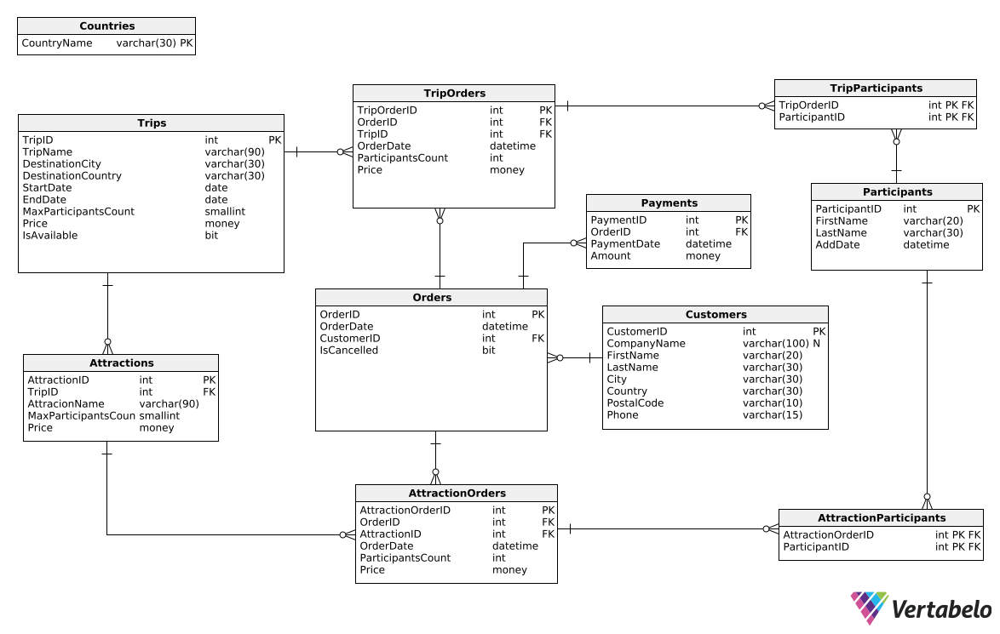

# Bazy danych

**Autorzy:**
Jakub Skwarczek,
Tymoteusz Szwech,
Jakub Warchoł

## 1. Wymagania i funkcje systemu

Lista funkcji jakie użytkownik może wykonywać w systemie.

1. Uzyskanie informacji na temat dostępnej oferty wraz z ilością miejsc oraz ceną.
2. Dodanie rezerwacji wraz z wymaganymi danymi.
3. Zmiana informacji na temat rezerwacji.
4. Anulowanie rezerwacji.
5. Rezerwacja usług/atrakcji w ramach jednej wycieczki.
6. Dodanie informacji na temat płatności.
7. Rejestracja i modyfikacja danych uczestników wycieczki.

## 2. Baza danych

### Schemat bazy danych



### Opis poszczególnych tabel

Nazwa tabeli: **Payments**

- Opis: Tabela zawierająca informacje dotyczące opłat: daty ich wykonania, kwoty, oraz tego jakiego zamówienia dotyczą.

| Nazwa atrybutu | Typ      | Opis/Uwagi                                    |
| -------------- | -------- | --------------------------------------------- |
| PaymentID      | int      | Identyfikator płatności                       |
| PaymentDate    | datetime | Data dokonania płatności                      |
| Amount         | money    | Kwota płatności                               |
| OrderID        | int      | Identyfikator zamówienia, które jest opłacane |

- kod DDL

```sql
CREATE TABLE Payments (
    PaymentID int  NOT NULL,
    PaymentDate datetime  NOT NULL,
    Amount money  NOT NULL,
    OrderID int  NOT NULL,
    CONSTRAINT Payments_pk PRIMARY KEY  (PaymentID)
);
```

Nazwa tabeli: **TripOrders**

- Opis: Tabela z zamówieniami wycieczek, zawierająca informacje między innymi na temat klienta, który złożył zamówienie.

| Nazwa atrybutu    | Typ      | Opis/Uwagi                                       |
| ----------------- | -------- | ------------------------------------------------ |
| OrderID           | int      | Identyfikator zamówienia wycieczki               |
| TripID            | int      | Identyfikator wycieczki, która została zamówiona |
| CustomerID        | int      | Identyfikator klienta składającego zamówienie    |
| ParticipantsCount | int      | Liczba uczestników zamówionej wycieczki          |
| OrderDate         | datetime | Data, kiedy zostało złożone zamówienie           |
| Price             | money    | Cena zamówienia                                  |
| IsCancelled       | bit      | Czy zamówienie jest anulowane                    |

- kod DDL

```sql
CREATE TABLE TripOrders (
    OrderID int  NOT NULL,
    TripID int  NOT NULL,
    CustomerID int  NOT NULL,
    ParticipantsCount int  NOT NULL,
    OrderDate datetime  NOT NULL,
    Price money  NOT NULL,
    IsCancelled bit  NOT NULL,
    CONSTRAINT OrderID PRIMARY KEY  (OrderID)
);
```

Nazwa tabeli: **Participants**

- Opis: Tabela zawierająca uczestników oraz zamówienia, do których są podpięci.

| Nazwa atrybutu | Typ         | Opis/Uwagi                                                            |
| -------------- | ----------- | --------------------------------------------------------------------- |
| ParticipantID  | int         | Identyfikator uczestnika                                              |
| OrderID        | int         | Identyfikator zamówienia wycieczki, z którym powiązany jest uczestnik |
| FirstName      | varchar(20) | Imię uczestnika                                                       |
| LastName       | varchar(30) | Nazwisko uczestnika                                                   |
| AddDate        | datetime    | Data dodania uczestnika                                               |

- kod DDL

```sql
CREATE TABLE Participants (
    ParticipantID int  NOT NULL,
    OrderID int  NOT NULL,
    FirstName varchar(20)  NOT NULL,
    LastName varchar(30)  NOT NULL,
    AddDate datetime  NOT NULL,
    CONSTRAINT Participants_pk PRIMARY KEY  (ParticipantID)
);
```

Nazwa tabeli: **Customers**

- Opis: Tabela z listą klientów oraz ich danymi.

| Nazwa atrybutu | Typ          | Opis/Uwagi                             |
| -------------- | ------------ | -------------------------------------- |
| CustomerID     | int          | Identyfikator klienta                  |
| CompanyName    | varchar(100) | Nazwa firmy klienta                    |
| FirstName      | varchar(20)  | Imię klienta / reprezentanta firmy     |
| LastName       | varchar(30)  | Nazwisko klienta / reprezentanta firmy |
| City           | varchar(30)  | Miasto, w którym znajduje się firma    |
| Country        | varchar(30)  | Kraj, w którym znajduje się firma      |
| PostalCode     | varchar(10)  | Kod pocztowy                           |
| Phone          | varchar(15)  | Telefon kontaktowy do klienta          |

- kod DDL

```sql
CREATE TABLE Customers (
    CustomerID int  NOT NULL,
    CompanyName varchar(100)  NULL,
    FirstName varchar(20)  NOT NULL,
    LastName varchar(30)  NOT NULL,
    City varchar(30)  NOT NULL,
    Country varchar(30)  NOT NULL,
    PostalCode varchar(10)  NOT NULL,
    Phone varchar(15)  NOT NULL,
    CONSTRAINT Customers_pk PRIMARY KEY  (CustomerID)
);
```

Nazwa tabeli: **Trips**

- Opis: Tabela zawierająca informacje dotyczące dostępnych do zamówienia wycieczek.

| Nazwa atrybutu       | Typ         | Opis/Uwagi                                      |
| -------------------- | ----------- | ----------------------------------------------- |
| TripID               | int         | Identyfikator wycieczki                         |
| TripName             | varchar(90) | Nazwa wycieczki                                 |
| DestinationCity      | varchar(30) | Miasto, do którego jest wycieczka               |
| DestinationCountry   | varchar(30) | Kraj, do którego jest wycieczka                 |
| StartDate            | datetime    | Początek wycieczki                              |
| EndDate              | datetime    | Koniec wycieczki                                |
| MaxParticipantsCount | smallint    | Maksymalna liczba osób, które mogą uczestniczyć |
| Price                | money       | Koszt wycieczki                                 |

- kod DDL

```sql
CREATE TABLE Trips (
    TripID int  NOT NULL,
    TripName varchar(90)  NOT NULL,
    DestinationCity varchar(30)  NOT NULL,
    DestinationCountry varchar(30)  NOT NULL,
    StartDate datetime  NOT NULL,
    EndDate datetime  NOT NULL,
    MaxParticipantsCount smallint  NOT NULL,
    Price money  NOT NULL,
    CONSTRAINT Trips_pk PRIMARY KEY  (TripID)
);
```

Nazwa tabeli: **Attractions**

- Opis: Tabela zawierająca listę dostępnych atrakcji dla wycieczek.

| Nazwa atrybutu       | Typ         | Opis/Uwagi                   |
| -------------------- | ----------- | ---------------------------- |
| AttractionID         | int         | Identyfikator atrakcji       |
| TripID               | int         | Identyfikator wycieczki      |
| AttractionName       | varchar(90) | Nazwa atrakcji               |
| MaxParticipantsCount | smallint    | Maksymalna ilość uczestników |
| Price                | money       | Koszt atrakcji               |

- kod DDL

```sql
CREATE TABLE Attractions (
    AttractionID int  NOT NULL,
    TripID int  NOT NULL,
    AttracionName varchar(90)  NOT NULL,
    MaxParticipantsCount smallint  NOT NULL,
    Price money  NOT NULL,
    CONSTRAINT Attractions_pk PRIMARY KEY  (AttractionID)
);
```

Nazwa tabeli: **AttractionOrders**

- Opis: Dodatkowe zamówienia atrakcji podpięte pod zamówienie wycieczki.

| Nazwa atrybutu    | Typ      | Opis/Uwagi                             |
| ----------------- | -------- | -------------------------------------- |
| AttractionOrderID | int      | Identyfikator zamówienia atrakcji      |
| OrderID           | int      | Identyfikator zamówienia wycieczki     |
| AttractionID      | int      | Identyfikator atrakcji                 |
| OrderDate         | datetime | Data, kiedy zostało złożone zamówienie |
| ParticipantsCount | int      | Liczba uczestników                     |
| Price             | money    | Koszt zamówienia                       |

- kod DDL

```sql
CREATE TABLE AttractionOrders (
    AttractionOrderID int  NOT NULL,
    OrderID int  NOT NULL,
    AttractionID int  NOT NULL,
    OrderDate datetime  NOT NULL,
    ParticipantsCount int  NOT NULL,
    Price money  NOT NULL,
    CONSTRAINT AttractionOrders_pk PRIMARY KEY  (AttractionOrderID)
);
```

Nazwa tabeli: **AttractionParticipants**

- Opis: Tabela zawierająca identyfikatory uczestników powiązane z konkretnymi zamówieniami atrakcji. Powiązani uczestnicy są na nie zapisani.

| Nazwa atrybutu    | Typ | Opis/Uwagi                        |
| ----------------- | --- | --------------------------------- |
| AttractionOrderID | int | Identyfikator zamówienia atrakcji |
| ParticipantID     | int | Identyfikator uczestnika          |

- kod DDL

```sql
CREATE TABLE AttractionParticipants (
    AttractionOrderID int  NOT NULL,
    ParticipantID int  NOT NULL,
    CONSTRAINT AttractionParticipants_pk PRIMARY KEY  (AttractionOrderID,ParticipantID)
);
```

## 3. Widoki, procedury/funkcje, triggery

## 4. Inne
