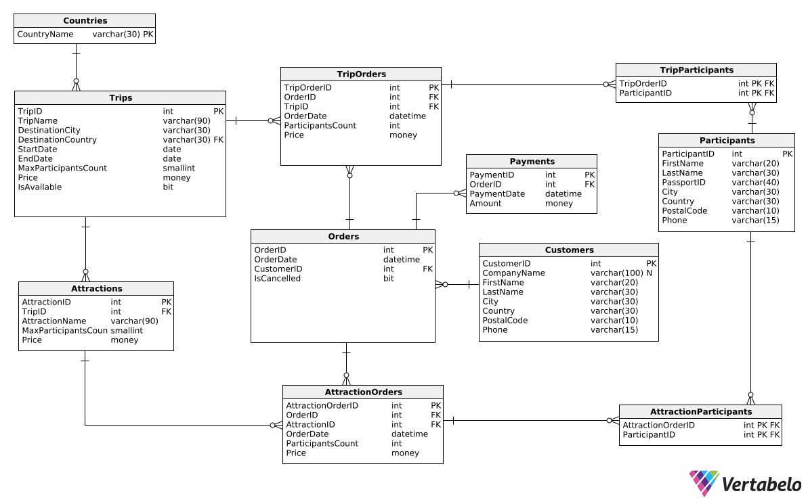

# Bazy danych

**Autorzy:**
Jakub Skwarczek,
Tymoteusz Szwech,
Jakub Warchoł

## 1. Wymagania i funkcje systemu

System wspomaga działalność firmy świadczącej usługi turystyczne. Oferuje on rezerwację różnorodnych wycieczek z określoną datą, limitem miejsc i ceną. Klienci mogą dodatkowo rezerwować usługi i atrakcje związane z daną wycieczką, które również mają swoje limity miejsc i ceny.

Klientami są zarówno osoby prywatne, jak i firmy, które dokonują rezerwacji i płatności za uczestników wycieczki. Przy rezerwacji klient podaje liczbę miejsc oraz wybiera dodatkowe usługi, a najpóźniej na tydzień przed wyjazdem musi podać imiona i nazwiska uczestników. Brak tych danych lub pełnej wpłaty skutkuje anulowaniem zamówienia.

Rezerwacje dodatkowych usług są możliwe tylko wraz z rezerwacją wycieczki. Zmiany w rezerwacji można wprowadzać do tygodnia przed wyjazdem. Po tym terminie zamówienie musi być w pełni opłacone i nie można wprowadzać żadnych zmian. System zapewnia przejrzystość i wygodę obsługi, wspierając efektywne zarządzanie wycieczkami i usługami dodatkowymi.

Lista funkcji jakie użytkownik może wykonywać w systemie.

1. Uzyskanie informacji na temat dostępnej oferty wraz z ilością miejsc oraz ceną.
2. Dodanie rezerwacji wraz z wymaganymi danymi.
3. Zmiana informacji na temat rezerwacji.
4. Anulowanie rezerwacji.
5. Rezerwacja usług/atrakcji w ramach jednej wycieczki.
6. Dodanie informacji na temat płatności.
7. Rejestracja i modyfikacja danych uczestników wycieczki.

## 2. Baza danych

### Schemat bazy danych



### Opis poszczególnych tabel

Nazwa tabeli: **Countries**

- Opis: Tabela słownikowa zawierająca nazwy państw.

| Nazwa atrybutu | Typ         | Opis/Uwagi             |
| -------------- | ----------- | ---------------------- |
| CountryName    | varchar(30) | Nazwa państwa (**PK, FK**) |

- kod DDL

```sql
CREATE TABLE Countries (
    CountryName varchar(30)  NOT NULL,
    CONSTRAINT Countries_pk PRIMARY KEY  (CountryName)
);
```

Nazwa tabeli: **Trips**

- Opis: Tabela zawierająca informacje dotyczące dostępnych do zamówienia wycieczek.

| Nazwa atrybutu       | Typ         | Opis/Uwagi                                                                        |
| -------------------- | ----------- | --------------------------------------------------------------------------------- |
| TripID               | int         | Identyfikator wycieczki (**PK**)                                                  |
| TripName             | varchar(90) | Nazwa wycieczki                                                                   |
| DestinationCity      | varchar(30) | Miasto, do którego jest wycieczka                                                 |
| DestinationCountry   | varchar(30) | Kraj, do którego jest wycieczka (**FK**)                                          |
| StartDate            | date        | Początek wycieczki; **StartDate < EndDate** - data początku jest przed datą końca |
| EndDate              | date        | Koniec wycieczki                                                                  |
| MaxParticipantsCount | smallint    | Maksymalna liczba osób, które mogą uczestniczyć; **MaxParticipantsCount > 0**     |
| Price                | money       | Koszt wycieczki; **Price >= 0**                                                   |
| IsAvailable          | bit         | Czy wycieczka jest dostępna do zamówienia (0 - nie, 1 - tak); **DEFAULT - 0**     |

- kod DDL

```sql
CREATE TABLE Trips (
    TripID int  NOT NULL,
    TripName varchar(90)  NOT NULL,
    DestinationCity varchar(30)  NOT NULL,
    DestinationCountry varchar(30)  NOT NULL,
    StartDate date  NOT NULL,
    EndDate date  NOT NULL,
    MaxParticipantsCount smallint  NOT NULL,
    Price money  NOT NULL,
    IsAvailable bit  NOT NULL DEFAULT 0,
    CONSTRAINT Trips_DateCheck CHECK (StartDate < EndDate),
    CONSTRAINT Trips_PriceCheck CHECK (Price >= 0),
    CONSTRAINT Trips_MPCheck CHECK (MaxParticipantsCount > 0),
    CONSTRAINT Trips_pk PRIMARY KEY  (TripID)
);

ALTER TABLE Trips ADD CONSTRAINT Trips_Countries
    FOREIGN KEY (DestinationCountry)
    REFERENCES Countries (CountryName);
```

Nazwa tabeli: **Attractions**

- Opis: Tabela zawierająca listę dostępnych atrakcji dla wycieczek.

| Nazwa atrybutu       | Typ         | Opis/Uwagi                                                 |
| -------------------- | ----------- | ---------------------------------------------------------- |
| AttractionID         | int         | Identyfikator atrakcji (**PK**)                            |
| TripID               | int         | Identyfikator wycieczki (**FK**)                           |
| AttractionName       | varchar(90) | Nazwa atrakcji                                             |
| MaxParticipantsCount | smallint    | Maksymalna ilość uczestników; **MaxParticipantsCount > 0** |
| Price                | money       | Koszt atrakcji; **Price >= 0**                             |

- kod DDL

```sql
CREATE TABLE Attractions (
    AttractionID int  NOT NULL,
    TripID int  NOT NULL,
    AttractionName varchar(90)  NOT NULL,
    MaxParticipantsCount smallint  NOT NULL,
    Price money  NOT NULL,
    CONSTRAINT Attractions_PriceCheck CHECK (Price >= 0),
    CONSTRAINT Attractions_MPCheck CHECK (MaxParticipantsCount > 0),
    CONSTRAINT Attractions_pk PRIMARY KEY  (AttractionID)
);

ALTER TABLE Attractions ADD CONSTRAINT Attractions_Trips
    FOREIGN KEY (TripID)
    REFERENCES Trips (TripID);
```

Nazwa tabeli: **Orders**

- Opis: Tabela zawierająca najważniejsze informacje dotyczące głównego zamówienia tj. datę oraz identyfikator klienta.

| Nazwa atrybutu | Typ      | Opis/Uwagi                                                           |
| -------------- | -------- | -------------------------------------------------------------------- |
| OrderID        | int      | Identyfikator zamówienia (**PK**)                                    |
| OrderDate      | int      | Data złożenia zamówienia                                             |
| CustomerID     | datetime | Identyfikator klienta, który złożył zamówienie (**FK**)              |
| IsCancelled    | bit      | Czy zamówienie zostało anulowane (0 - nie, 1 - tak); **DEFAULT - 0** |

- kod DDL

```sql
CREATE TABLE Orders (
    OrderID int  NOT NULL,
    OrderDate datetime  NOT NULL,
    CustomerID int  NOT NULL,
    IsCancelled bit  NOT NULL DEFAULT 0,
    CONSTRAINT Orders_pk PRIMARY KEY  (OrderID)
);

ALTER TABLE Orders ADD CONSTRAINT Orders_Customers
    FOREIGN KEY (CustomerID)
    REFERENCES Customers (CustomerID);
```

Nazwa tabeli: **Payments**

- Opis: Tabela zawierająca informacje dotyczące opłat: daty ich wykonania, kwoty, oraz tego jakiego zamówienia dotyczą.

| Nazwa atrybutu | Typ      | Opis/Uwagi                                             |
| -------------- | -------- | ------------------------------------------------------ |
| PaymentID      | int      | Identyfikator płatności (**PK**)                       |
| OrderID        | int      | Identyfikator zamówienia, które jest opłacane (**FK**) |
| PaymentDate    | datetime | Data dokonania płatności                               |
| Amount         | money    | Kwota płatności; **Amount >= 0**                       |

- kod DDL

```sql
CREATE TABLE Payments (
    PaymentID int  NOT NULL,
    OrderID int  NOT NULL,
    PaymentDate datetime  NOT NULL,
    Amount money  NOT NULL,
    CONSTRAINT Payments_AmountCheck CHECK (Amount >= 0),
    CONSTRAINT Payments_pk PRIMARY KEY  (PaymentID)
);

ALTER TABLE Payments ADD CONSTRAINT Payments_Orders
    FOREIGN KEY (OrderID)
    REFERENCES Orders (OrderID);
```

Nazwa tabeli: **TripOrders**

- Opis: Tabela z zamówieniami wycieczek, zawierająca informacje między innymi na temat daty złożenia zamówienia.

| Nazwa atrybutu    | Typ      | Opis/Uwagi                                                         |
| ----------------- | -------- | ------------------------------------------------------------------ |
| TripOrderID       | int      | Identyfikator zamówienia wycieczki (**PK**)                        |
| OrderID           | int      | Identyfikator zamówienia (**FK**)                                  |
| TripID            | int      | Identyfikator wycieczki, która została zamówiona (**FK**)          |
| OrderDate         | datetime | Data, kiedy zostało złożone zamówienie                             |
| ParticipantsCount | int      | Liczba uczestników zamówionej wycieczki; **ParticipantsCount > 0** |
| Price             | money    | Cena zamówienia; **Price >= 0**                                    |

- kod DDL

```sql
CREATE TABLE TripOrders (
    TripOrderID int  NOT NULL,
    OrderID int  NOT NULL,
    TripID int  NOT NULL,
    OrderDate datetime  NOT NULL,
    ParticipantsCount int  NOT NULL,
    Price money  NOT NULL,
    CONSTRAINT TripOrders_PriceCheck CHECK (Price >= 0),
    CONSTRAINT TripOrders_ParticipantCountCheck CHECK (ParticipantsCount > 0),
    CONSTRAINT OrderID PRIMARY KEY  (TripOrderID)
);

ALTER TABLE TripOrders ADD CONSTRAINT TripOrders_Orders
    FOREIGN KEY (OrderID)
    REFERENCES Orders (OrderID);

ALTER TABLE TripOrders ADD CONSTRAINT TripOrders_Trips
    FOREIGN KEY (TripID)
    REFERENCES Trips (TripID);
```

Nazwa tabeli: **TripParticipants**

- Opis: Tabela zawierająca identyfikatory uczestników powiązane z konkretnymi zamówieniami wycieczek. Powiązani uczestnicy są na nie zapisani.

| Nazwa atrybutu | Typ | Opis/Uwagi                                      |
| -------------- | --- | ----------------------------------------------- |
| TripOrderID    | int | Identyfikator zamówienia wycieczki (**PK, FK**) |
| ParticipantID  | int | Identyfikator uczestnika (**PK, FK**)           |

- kod DDL

```sql
CREATE TABLE TripParticipants (
    TripOrderID int  NOT NULL,
    ParticipantID int  NOT NULL,
    CONSTRAINT TripParticipants_pk PRIMARY KEY  (TripOrderID,ParticipantID)
);

ALTER TABLE TripParticipants ADD CONSTRAINT TripParticipants_Participants
    FOREIGN KEY (ParticipantID)
    REFERENCES Participants (ParticipantID);

ALTER TABLE TripParticipants ADD CONSTRAINT TripParticipants_TripOrders
    FOREIGN KEY (TripOrderID)
    REFERENCES TripOrders (TripOrderID);
```

Nazwa tabeli: **AttractionOrders**

- Opis: Dodatkowe zamówienia atrakcji podpięte pod zamówienie.

| Nazwa atrybutu    | Typ      | Opis/Uwagi                                    |
| ----------------- | -------- | --------------------------------------------- |
| AttractionOrderID | int      | Identyfikator zamówienia atrakcji (**PK**)    |
| OrderID           | int      | Identyfikator zamówienia wycieczki (**FK**)   |
| AttractionID      | int      | Identyfikator atrakcji (**FK**)               |
| OrderDate         | datetime | Data, kiedy zostało złożone zamówienie        |
| ParticipantsCount | int      | Liczba uczestników; **ParticipantsCount > 0** |
| Price             | money    | Koszt zamówienia; **Price >= 0**              |

- kod DDL

```sql
CREATE TABLE AttractionOrders (
    AttractionOrderID int  NOT NULL,
    OrderID int  NOT NULL,
    AttractionID int  NOT NULL,
    OrderDate datetime  NOT NULL,
    ParticipantsCount int  NOT NULL,
    Price money  NOT NULL,
    CONSTRAINT AttractionOrders_PriceCheck CHECK (Price >= 0),
    CONSTRAINT AttractionOrders_PCCheck CHECK (ParticipantsCount > 0),
    CONSTRAINT AttractionOrders_pk PRIMARY KEY  (AttractionOrderID)
);

ALTER TABLE AttractionOrders ADD CONSTRAINT AttractionOrders_Attractions
    FOREIGN KEY (AttractionID)
    REFERENCES Attractions (AttractionID);

ALTER TABLE AttractionOrders ADD CONSTRAINT AttractionOrders_Orders
    FOREIGN KEY (OrderID)
    REFERENCES Orders (OrderID);
```

Nazwa tabeli: **AttractionParticipants**

- Opis: Tabela zawierająca identyfikatory uczestników powiązane z konkretnymi zamówieniami atrakcji. Powiązani uczestnicy są na nie zapisani.

| Nazwa atrybutu    | Typ | Opis/Uwagi                                     |
| ----------------- | --- | ---------------------------------------------- |
| AttractionOrderID | int | Identyfikator zamówienia atrakcji (**PK, FK**) |
| ParticipantID     | int | Identyfikator uczestnika (**PK, FK**)          |

- kod DDL

```sql
CREATE TABLE AttractionParticipants (
    AttractionOrderID int  NOT NULL,
    ParticipantID int  NOT NULL,
    CONSTRAINT AttractionParticipants_pk PRIMARY KEY  (AttractionOrderID,ParticipantID)
);

ALTER TABLE AttractionParticipants ADD CONSTRAINT do_nazwania_AttractionOrders
    FOREIGN KEY (AttractionOrderID)
    REFERENCES AttractionOrders (AttractionOrderID);

ALTER TABLE AttractionParticipants ADD CONSTRAINT do_nazwania_Participants
    FOREIGN KEY (ParticipantID)
    REFERENCES Participants (ParticipantID);
```

Nazwa tabeli: **Participants**

- Opis: Tabela zawierająca informacje na temat uczestników.

| Nazwa atrybutu | Typ         | Opis/Uwagi                                       |
| -------------- | ----------- | ------------------------------------------------ |
| ParticipantID  | int         | Identyfikator uczestnika (**PK**)                |
| FirstName      | varchar(20) | Imię uczestnika                                  |
| LastName       | varchar(30) | Nazwisko uczestnika                              |
| PassportID     | varchar(40) | Identyfikator paszportu uczesnika                |
| City           | varchar(30) | Miasto zamieszkania uczestnika                   |
| Country        | varchar(30) | Kraj, z którego pochodzi uczestnik               |
| PostalCode     | varchar(10) | Kod pocztowy                                     |
| Phone          | varchar(15) | Telefon kontaktowy do uczestnika                 |


- kod DDL

```sql
CREATE TABLE Participants (
    ParticipantID int  NOT NULL,
    FirstName varchar(20)  NOT NULL,
    LastName varchar(30)  NOT NULL,
    PassportID varchar(40)  NOT NULL,
    City varchar(30)  NOT NULL,
    Country varchar(30)  NOT NULL,
    PostalCode varchar(10)  NOT NULL,
    Phone varchar(15)  NOT NULL,
    CONSTRAINT Participants_pk PRIMARY KEY  (ParticipantID)
);
```

Nazwa tabeli: **Customers**

- Opis: Tabela z listą klientów oraz ich danymi.

| Nazwa atrybutu | Typ          | Opis/Uwagi                             |
| -------------- | ------------ | -------------------------------------- |
| CustomerID     | int          | Identyfikator klienta (**PK**)         |
| CompanyName    | varchar(100) | Nazwa firmy klienta                    |
| FirstName      | varchar(20)  | Imię klienta / reprezentanta firmy     |
| LastName       | varchar(30)  | Nazwisko klienta / reprezentanta firmy |
| City           | varchar(30)  | Miasto, w którym znajduje się firma    |
| Country        | varchar(30)  | Kraj, w którym znajduje się firma      |
| PostalCode     | varchar(10)  | Kod pocztowy                           |
| Phone          | varchar(15)  | Telefon kontaktowy do klienta          |

- kod DDL

```sql
CREATE TABLE Customers (
    CustomerID int  NOT NULL,
    CompanyName varchar(100)  NULL,
    FirstName varchar(20)  NOT NULL,
    LastName varchar(30)  NOT NULL,
    City varchar(30)  NOT NULL,
    Country varchar(30)  NOT NULL,
    PostalCode varchar(10)  NOT NULL,
    Phone varchar(15)  NOT NULL,
    CONSTRAINT Customers_pk PRIMARY KEY  (CustomerID)
);
```

## 3. Widoki, procedury/funkcje, triggery

### Warunki integralności - triggery

### Widoki

Nazwa widoku: **TripParticipantsCount**

- Opis: Widok ten wyświetla sumę uczestników, która jest zapisana na konkretną wycieczkę. Oprócz tego podaje maksymalną liczbę uczestników na tę wycieczkę oraz ilość wolnych miejsc.

```sql
CREATE VIEW TripParticipantsCount
AS
SELECT Trips.TripID, StartDate AS TripDate, SUM(ParticipantsCount) AS SumParticipants,
       MaxParticipantsCount, MaxParticipantsCount - SUM(ParticipantsCount) as SlotsLeft
FROM TripOrders
JOIN Trips ON Trips.TripID = TripOrders.TripID
GROUP BY Trips.TripID, StartDate, MaxParticipantsCount;
```

Nazwa widoku: **AttractionParticipantsCount**

- Opis: Widok ten wyświetla sumę uczestników, która jest zapisana na konkretną atrakcję. Oprócz tego podaje maksymalną liczbę uczestników atrakcji, numer wycieczki, do której ta atrakcja jest przypisana, jak i liczbę pozostałych miejsc.

```sql
CREATE VIEW AttractionParticipantsCount
AS
SELECT Trips.TripID, Attractions.AttractionID, Trips.StartDate AS TripDate,
       SUM(ParticipantsCount) AS SumParticipants, Attractions.MaxParticipantsCount,
       Attractions.MaxParticipantsCount - SUM(ParticipantsCount) as SlotsLeft
FROM AttractionOrders
JOIN Attractions ON Attractions.AttractionID = AttractionOrders.AttractionID
JOIN Trips ON Trips.TripID = Attractions.TripID
GROUP BY Trips.TripID, Attractions.AttractionID, Trips.StartDate, Attractions.MaxParticipantsCount;
```

Nazwa widoku: **TotalPrice**

- Opis: Widok ten wyświetla sumę kosztów wszystkich zamówionych wycieczek oraz atrakcji dla konkretnego zamówienia. Wyświetla również sumę wszelkich opłat wykonanych w ramach tego zamówienie.

```sql
CREATE VIEW TotalPrice
AS
SELECT OrderID,
        (SELECT ISNULL(SUM(Price), 0)
         FROM TripOrders
         WHERE Orders.OrderID = TripOrders.OrderID) AS TripPrice,
        (SELECT ISNULL(SUM(Price), 0)
         FROM AttractionOrders
         WHERE Orders.OrderID = AttractionOrders.OrderID) AS AttractionPrice,
        (SELECT ISNULL(SUM(Amount), 0)
         FROM Payments
         WHERE Orders.OrderID = Payments.OrderID) AS Amount
FROM Orders;
```

Nazwa widoku: **SumCustomerOrders**

- Opis: Widok ten wyświetla liczbę zamówień złożonych przez każdego klienta.

```sql
CREATE VIEW SumCustomerOrders
AS
SELECT Customers.CustomerID, COUNT(OrderID) AS AllOrders
FROM Customers
JOIN Orders ON Orders.CustomerID = Customers.CustomerID
GROUP BY Customers.CustomerID;
```

Nazwa widoku: **UnpaidOrders**

- Opis: Wyświetla numery wszystkich zamówień (oraz identyfikator klienta, który je złożył), które nie zostały jeszcze w pełni opłacone oraz brakującą sumę do zapłacenia.

```sql
CREATE VIEW UnpaidOrders
AS
SELECT TotalPrice.OrderID, Orders.CustomerID,
       TripPrice + AttractionPrice - Amount AS LeftToPay
FROM TotalPrice
JOIN Orders ON Orders.OrderID = TotalPrice.OrderID
WHERE TripPrice + AttractionPrice - Amount > 0
```

Nazwa widoku: **CustomerParticipantList**

- Opis: Wyświetla listę wszystkich dodanych uczestników przez danego klienta w ramach danej wycieczki.

```sql
CREATE VIEW CustomerParticipantList
AS
SELECT Customers.CustomerID, Participants.ParticipantID, Orders.OrderID, Orders.OrderDate
FROM Customers
JOIN Orders on Customers.CustomerID = Orders.CustomerID
JOIN TripOrders on Orders.OrderID = TripOrders.OrderID
JOIN TripParticipants on TripOrders.TripOrderID = TripParticipants.TripOrderID
JOIN Participants on TripParticipants.ParticipantID = Participants.ParticipantID;
```

### Procedury

Nazwa procedury: **AllUnpaidByCustomer**

- Opis: Wyświetla wszystkie numery wycieczek, które nie zostały opłacone przez danego klienta, wraz z brakującą kwotą.

```sql
CREATE PROCEDURE AllUnpaidByCustomer @CustomerID int
AS
SELECT OrderID, LeftToPay
FROM UnpaidOrders
WHERE CustomerID = @CustomerID
```

Nazwa procedury: **ListTripParticipants**

- Opis: Wylistowuje dane wszystkich uczestników, którzy są zapisani do konkretnego zamówienia.

```sql
CREATE PROCEDURE ListTripParticipants @OrderID int
AS
SELECT OrderID, ParticipantID
FROM CustomerParticipantList
WHERE OrderID = @OrderID;
```

## 4. Inne

